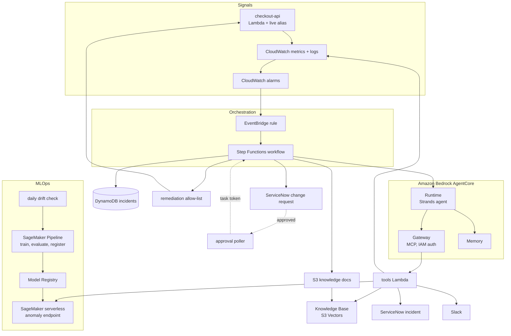
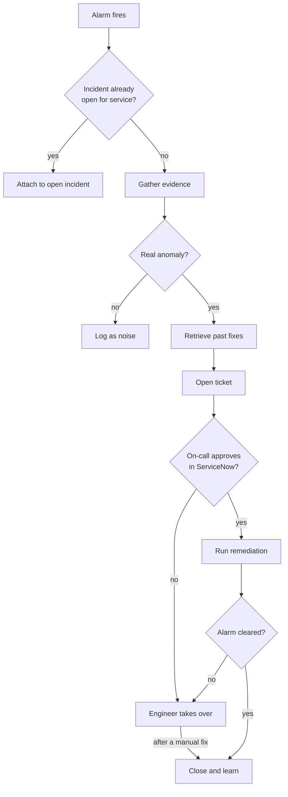

# Architecture

GitHub renders these diagrams. The polished versions are in the design doc.

## System

```mermaid
flowchart TB
  subgraph Signals
    app[checkout-api<br/>Lambda + live alias] --> cw[CloudWatch metrics + logs] --> alarms[CloudWatch alarms]
  end
  subgraph Orchestration
    eb[EventBridge rule] --> sfn[Step Functions workflow]
  end
  subgraph AgentCore[Amazon Bedrock AgentCore]
    rt[Runtime<br/>Strands agent] --> gw[Gateway<br/>MCP, IAM auth]
    rt --> mem[Memory]
  end
  alarms --> eb
  sfn --> rt
  gw --> tools[tools Lambda]
  tools --> cw
  tools --> kb[Knowledge Base<br/>S3 Vectors]
  tools --> ep[SageMaker serverless<br/>anomaly endpoint]
  tools --> snow[ServiceNow incident]
  tools --> slack[Slack]
  sfn --> ddb[(DynamoDB incidents)]
  sfn --> chg[ServiceNow change request]
  chg -. approved .-> poll[approval poller] -. task token .-> sfn
  sfn --> fix[remediation allow-list] --> app
  sfn --> kbdocs[S3 knowledge docs] --> kb
  subgraph MLOps
    pipe[SageMaker Pipeline<br/>train, evaluate, register] --> reg[Model Registry] --> ep
    drift[daily drift check] --> pipe
  end
```

## Triage flow

```mermaid
flowchart TB
  a[Alarm fires] --> d1{Incident already<br/>open for service?}
  d1 -- yes --> att[Attach to open incident]
  d1 -- no --> ev[Gather evidence]
  ev --> d2{Real anomaly?}
  d2 -- no --> noise[Log as noise]
  d2 -- yes --> past[Retrieve past fixes] --> t[Open ticket] --> d3{On-call approves<br/>in ServiceNow?}
  d3 -- no --> human[Engineer takes over] -- after a manual fix --> close
  d3 -- yes --> rem[Run remediation] --> v{Alarm cleared?}
  v -- yes --> close[Close and learn]
  v -- no --> human
```
